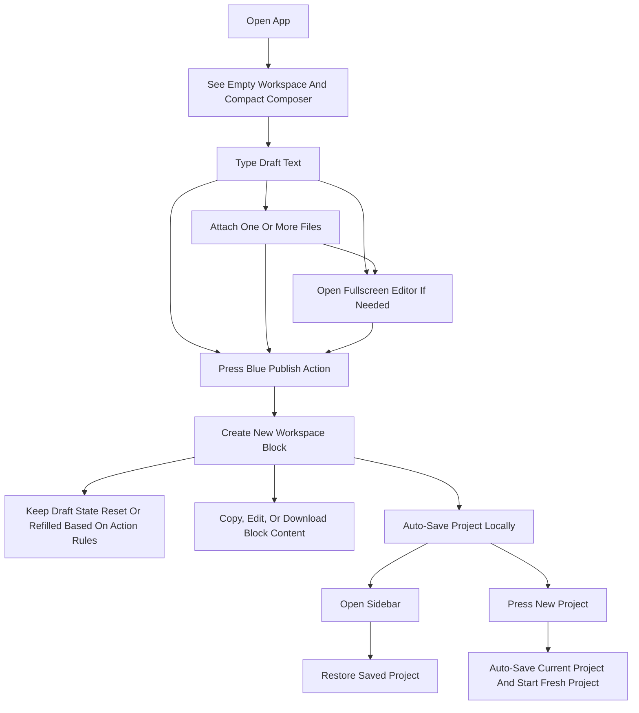

# Product Requirements Document

## 1. Product Overview
A mobile-first notebook-style web application built with plain HTML, CSS, and modern JavaScript.  
It combines a ChatGPT-like composer, inline attachments, fullscreen editing, project persistence, and a workspace that stores published blocks.

- Primary purpose: let users compose text with attachments, publish it into a visual workspace, and manage multiple saved projects from a sidebar.
- Product value: delivers a lightweight app-like authoring experience that can later be packaged for Android with minimal changes.

## 2. Core Features

### 2.1 User Roles
No role distinction is required for the initial local-first product.

### 2.2 Feature Modules
1. **Home / Workspace Screen**: floating top controls, central workspace, bottom adaptive composer.
2. **Sidebar / Project Drawer**: saved project list, restore project, close on outside touch.
3. **Fullscreen Editor Overlay**: long-form editing with synchronized draft state.

### 2.3 Page Details
| Page Name | Module Name | Feature Description |
|-----------|-------------|---------------------|
| Home / Workspace | Top controls | Menu button opens sidebar, theme switch toggles active theme, new project button creates a fresh project after auto-saving current project |
| Home / Workspace | Workspace canvas | Displays published blocks in chronological order, keeps previous blocks unchanged, supports copy/edit/download interactions |
| Home / Workspace | Adaptive composer | Single adaptive input surface with placeholder, text auto-grow/shrink, attachment previews, plus button, fullscreen button, blue publish action |
| Home / Workspace | Attachment preview tray | Renders image thumbnails or file cards inside the composer, supports multiple files and per-item removal |
| Sidebar / Project Drawer | Project list | Shows locally saved projects, supports switching between projects, closes on backdrop tap |
| Fullscreen Editor Overlay | Expanded draft editor | Preserves draft text, attachments, caret, selection, and scroll position while offering a larger editing viewport |

## 3. Core Process
The user lands on a clean mobile workspace with an empty composer. They type text, optionally add multiple attachments, and the composer grows upward smoothly as content increases. If the draft becomes long, they can open fullscreen editing without losing draft state. Pressing the blue action button publishes the current draft as a new workspace block. The user can edit a block back into the composer, copy block content, download attachments, create a fresh project, and reopen previously saved projects from the sidebar.

## 4. User Interface Design

### 4.1 Design Style
- Primary colors: soft light neutral background, white composer surface, bright blue action accent, dark text/icons
- Secondary colors: subtle gray borders/shadows, theme-driven inversions for dark mode
- Button style: circular floating icon buttons with soft fill; composer buttons use strong visual affordance and large tap targets
- Font style: clean modern sans-serif with excellent Android readability
- Layout style: floating controls, oversized rounded surfaces, spacious vertical composition, mobile-app visual tone
- Icon style: minimal outline and utility icons with strong clarity at small sizes

### 4.2 Page Design Overview
| Page Name | Module Name | UI Elements |
|-----------|-------------|-------------|
| Home / Workspace | Top controls | Floating circular menu button, top-right theme toggle, top-right new project pencil button, optional utility plate behind theme area |
| Home / Workspace | Workspace canvas | Large empty or populated vertical notebook area, generous padding, scrollable block list |
| Home / Workspace | Adaptive composer | Rounded container, inline placeholder/text, fixed lower action row, smooth height animation, attachment cards within top content area |
| Home / Workspace | Publish action cluster | Blue circular action button on far right, fullscreen icon button appears beside it in longer draft state |
| Sidebar / Project Drawer | Drawer shell | Slide-in panel, project cards/list rows, dimmed backdrop, touch-outside dismissal |
| Fullscreen Editor Overlay | Editor layer | Full-height overlay, synchronized composer content, attachment preservation, easy close/back action |

### 4.3 Responsiveness
- Mobile-first only, optimized for Android portrait screens
- Safe-area aware spacing for modern devices
- Keyboard-aware composer positioning
- Touch-first hit areas and gesture-safe spacing
- Smooth scrolling and animation tuned for lower-power mobile hardware

## 5. Non-Functional Requirements
- No frameworks and no build process
- Previewable via `index.html` and a simple local web server
- Modular architecture with reusable features in isolated files
- Local-first persistence with a storage abstraction ready for cloud replacement
- High-performance transitions using CSS transforms, opacity, and measured height animation
- Future-ready support for AI, voice, markdown, history, search, folders, tabs, settings, offline, synchronization, export/import, drag-and-drop, undo/redo, and plugins

## 6. Acceptance Criteria
- The homepage visually matches the provided references as closely as practical in plain web technologies.
- The composer starts compact, grows upward smoothly while typing, shrinks smoothly while deleting, and resets exactly to the idle state when empty.
- Multiple attachments render inside the composer with per-file removal and automatic reflow.
- Fullscreen editing preserves full draft state, including cursor and scroll details.
- Publishing creates a new workspace block every time and never overwrites previous blocks.
- The sidebar manages multiple locally saved projects and restores full project state.
- Theme switching supports at least light and dark modes through a theme-file-based architecture.
