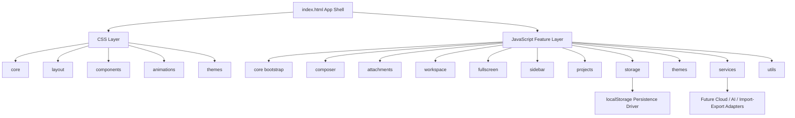

# Technical Architecture

## 1. Architecture Design


## 2. Technology Description
- Frontend: plain `HTML5` + `CSS3` + modern `JavaScript ES6 Modules`
- Initialization tool: none
- Backend: none for v1
- Database: none for v1, local persistence through `localStorage`
- Preview mode: open `index.html` directly for static UI review, or use a simple local server for full module/file behavior

## 3. Route Definitions
| Route | Purpose |
|-------|---------|
| `/` | Main mobile workspace application |

## 4. Module Architecture

### 4.1 App Shell
- Owns the static HTML landmarks and feature mount points.
- Provides semantic containers for:
  - top controls
  - sidebar layer
  - workspace surface
  - composer mount
  - fullscreen editor overlay
  - toast/dialog portals if needed later

### 4.2 State Model
- Use a centralized lightweight store written in vanilla JavaScript.
- Separate persisted state from ephemeral UI state.

Persisted state:
- active project id
- project collection
- per-project workspace blocks
- per-project composer draft
- attachments metadata and cached previews when possible
- active theme

Ephemeral UI state:
- sidebar open/closed
- fullscreen open/closed
- composer measured height
- current selection/caret snapshot
- temporary drag/touch UI states

### 4.3 Data Flow
- UI events dispatch to feature controllers.
- Feature controllers update the shared store.
- Store change subscriptions trigger targeted view updates.
- Persistence is debounced through a storage service.
- Renderer modules update only their owned DOM regions.

## 5. Data Definitions

### 5.1 Core Entities
```js
Project {
  id: string,
  name: string,
  createdAt: string,
  updatedAt: string,
  themeId: string,
  draft: Draft,
  blocks: WorkspaceBlock[]
}

Draft {
  text: string,
  attachments: AttachmentItem[],
  selectionStart: number,
  selectionEnd: number,
  scrollTop: number
}

WorkspaceBlock {
  id: string,
  createdAt: string,
  text: string,
  attachments: AttachmentItem[]
}

AttachmentItem {
  id: string,
  name: string,
  type: string,
  size: number,
  kind: "image" | "document" | "text" | "archive" | "generic",
  previewUrl: string | null,
  fileDataUrl: string | null
}
```

## 6. Folder Structure
```text
/workspace
├── index.html
├── assets/
│   ├── icons/
│   ├── images/
│   └── fonts/
├── css/
│   ├── core/
│   ├── layout/
│   ├── components/
│   ├── animations/
│   └── themes/
├── js/
│   ├── core/
│   ├── composer/
│   ├── attachments/
│   ├── workspace/
│   ├── fullscreen/
│   ├── sidebar/
│   ├── projects/
│   ├── storage/
│   ├── themes/
│   ├── services/
│   └── utils/
└── .trae/
    └── documents/
```

## 7. Why Each Folder Exists
- `assets/icons/`: stores SVG icons for menu, theme, pencil, plus, expand, send, copy, edit, and download actions
- `assets/images/`: stores static imagery and non-generated visual resources
- `assets/fonts/`: stores optional bundled font files for stable Android rendering
- `css/core/`: reset, tokens, variables, typography, base utilities, safe-area rules
- `css/layout/`: page-level structure such as app shell, workspace regions, sidebar overlay, and fullscreen layers
- `css/components/`: reusable component styling for composer, attachment cards, workspace blocks, buttons, and drawer items
- `css/animations/`: isolated motion definitions for resize, fade, slide, press, and overlay transitions
- `css/themes/`: separate theme token files so future themes can be added without rewriting component CSS
- `js/core/`: bootstrap, app store, event bus helpers, DOM refs, and app initialization flow
- `js/composer/`: textarea growth, placeholder logic, action row behavior, publishing, edit refill, and cursor tracking
- `js/attachments/`: file picking, validation, type mapping, preview generation, per-item removal, and download helpers
- `js/workspace/`: publish/render block logic, copy/edit actions, attachment interaction, and workspace updates
- `js/fullscreen/`: fullscreen overlay lifecycle, synchronized editing, and scroll/caret preservation
- `js/sidebar/`: drawer open/close handling, backdrop behavior, and project list rendering
- `js/projects/`: create/switch/rename future project workflows and project-level orchestration
- `js/storage/`: persistence adapters and serialization boundaries so `localStorage` can later be replaced by cloud storage
- `js/themes/`: theme registration, switching, persistence, and future theme discovery
- `js/services/`: higher-level external adapters for future AI, sync, export/import, and offline services
- `js/utils/`: focused shared helpers for IDs, dates, DOM measurement, throttling, debouncing, and file formatting

## 8. Reusability Strategy
- Each major feature owns:
  - its DOM contract
  - its styles
  - its controller logic
  - a narrow public API
- The composer is designed as a portable module with dependency injection for:
  - store access
  - attachment service
  - publish callback
  - fullscreen callback
- Storage uses adapter interfaces so local persistence can later be swapped for API-backed sync.
- Themes are token-driven so new theme files can be added without touching feature logic.

## 9. Performance Strategy
- Prefer CSS transitions for opacity, transform, and shadow changes.
- Use measured height animation only for the composer container and keep it isolated.
- Debounce persistence writes.
- Limit DOM re-rendering to affected regions instead of rebuilding the whole page.
- Use event delegation where practical for dynamic lists.
- Keep attachment previews lightweight and use object/data URLs responsibly.

## 10. Android Readiness
- Keep all navigation within a single-page shell to simplify WebView or Capacitor wrapping.
- Avoid build tooling and runtime dependencies to reduce packaging complexity.
- Respect viewport, safe-area insets, and touch ergonomics.
- Organize storage and service layers so native bridges can later replace browser-only implementations with minimal UI changes.
